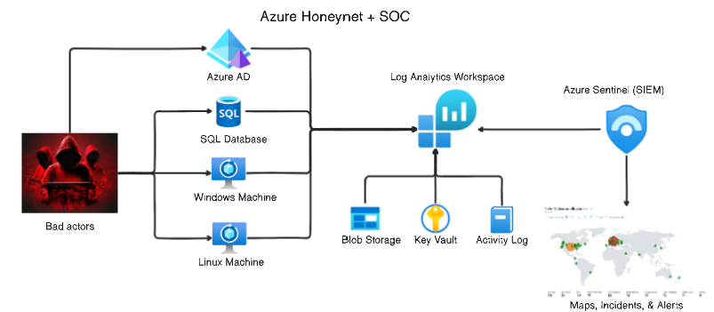

# Building a SOC in Azure + Honeynet  

## Introduction
In my journey to being a Cloud Security Engineer I will need to be familiar with Cybersecurity Incident Response and Cloud best practices to fortify workloads, so I decided to follow [Josh Madakors tutorial](https://www.terraform.io/) with some adjustments of my own to setup Azure Sentinel (SIEM) and connect it to a live virtual machines acting as a honeynet(not honeypot). I will observe live attacks (RDP Brute Force) from all around the world and harden the machines to remediate these vulnerabilities.
 
I built a mini honeynet in Azure and ingest logs from various resources into a Log Analytics Workspace, which is then used by Microsoft Sentinel to build attack maps, trigger alerts, and create incidents. I measured some security metrics in the insecure environment for 24 hours, applied security controls to harden the environment, measured metrics for another 24 hours, and then shared the results below. The metrics we will collect are:

- SecurityEvent (Windows Event Logs)
- Syslog (Linux Event Logs)
- SecurityAlert (Log Analytics Alerts Triggered)
- SecurityIncident (Incidents created by Sentinel)
- AzureNetworkAnalytics_CL (Malicious Flows allowed into our honeynet)
