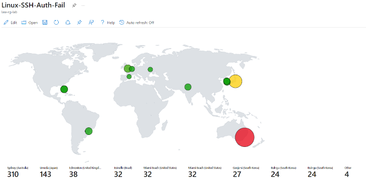
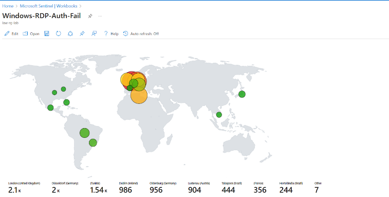
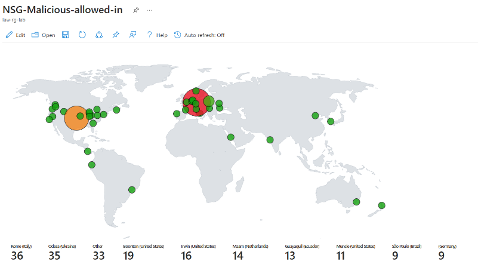

# Building a SOC in Azure + Honeynet  

## Introduction
In my journey to as an aspiring Cloud Security Engineer I will need to be familiar with Incident Response techniques and Cloud best practices to fortify workloads, so I decided to follow [Josh Madakors tutorial](https://youtu.be/RoZeVbbZ0o0?si=WG-UHymjShfwRbKk) with some adjustments of my own to setup Azure Sentinel (SIEM) and connect it to a live virtual machines acting as a honeynet(not honeypot). I will observe live attacks (RDP Brute Force) from all around the world and harden the machines to remediate these vulnerabilities.
 
I built a mini honeynet(2Vms in a VPC) in Azure and ingest logs from various resources into a Log Analytics Workspace, which is then used by Microsoft Sentinel to build attack maps, trigger alerts, and create incidents. I measured some security metrics in the insecure environment for 24 hours, applied security controls to harden the environment, measured metrics for another 24 hours, and then shared the results below. The metrics we will collect are:

- SecurityEvent (Windows Event Logs)
- Syslog (Linux Event Logs)
- SecurityAlert (Log Analytics Alerts Triggered)
- SecurityIncident (Incidents created by Sentinel)
- AzureNetworkAnalytics_CL (Malicious Flows allowed into our honeynet)

## Architecture
The architecture of the mini honeynet in Azure consists of the following components:

- Virtual Network (VNet)
- Network Security Group (NSG)
- Virtual Machines (2 windows, 1 linux)
- Log Analytics Workspace
- Azure Key Vault
- Azure Storage Account
- Microsoft Sentinel

## Attack Maps Before Hardening / Security Controls

## Metrics Before Hardening / Security Controls

## Attack Maps After Hardening / Security Controls
 
 All map queries actually returned no results due to no instances of malicious activity for the 24 hour period after hardening.

## Metrics After Hardening / Security Controls

## Summary
In this project, a mini honeynet was constructed in Microsoft Azure and the logs were pushed into a Log Analytics Workspace for analysis. Microsoft Sentinel was also employed to trigger alerts and create incidents based on the ingested logs. Additionally, metrics were measured in the insecure environment before security controls were applied, and then again after implementing security measures. The number of security events and incidents were drastically reduced after the security controls were applied, demonstrating their effectiveness.

It is worth noting that if the resources within the network were heavily utilized by regular users, it is likely that more security events and alerts may have been generated within the 24-hour period following the implementation of the security controls.
EDIT SUMMARY
